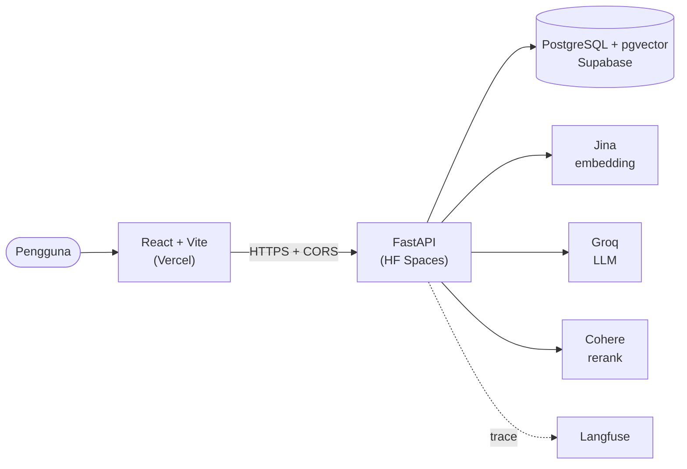
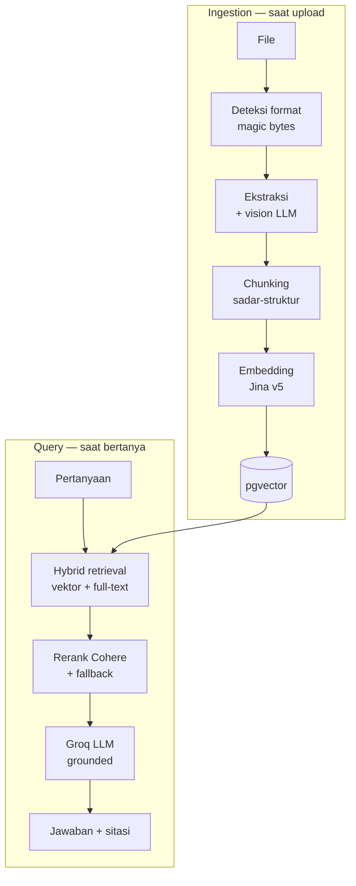
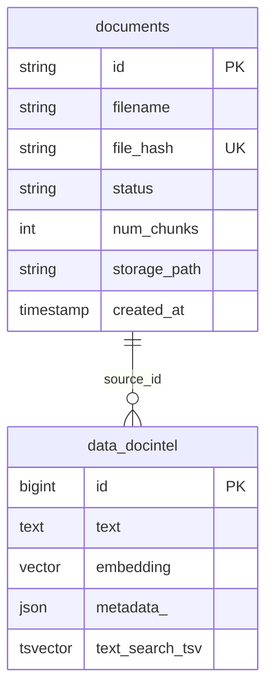

<div align="center">

# DocIntel — Document Intelligence System

### Sistem RAG untuk tanya-jawab dokumen internal multi-format, dengan jawaban yang grounded dan sitasi yang bisa dilacak langsung ke dokumen aslinya


[Demo Live](#demo-live) · [Arsitektur](#arsitektur) · [Menjalankan](#menjalankan-secara-lokal) · [API](#api) · [Contoh Q&A](#contoh-tanya-jawab) · [Tech Stack](#tech-stack)

</div>

---

## Daftar Isi

- [Ringkasan](#ringkasan)
- [Demo Live](#demo-live)
- [Fitur Utama](#fitur-utama)
- [Arsitektur](#arsitektur)
- [Alur Pipeline](#alur-pipeline)
- [Model Data](#model-data)
- [Menjalankan Secara Lokal](#menjalankan-secara-lokal)
- [API](#api)
- [Contoh Tanya-Jawab](#contoh-tanya-jawab)
- [Pengujian dan CI](#pengujian-dan-ci)
- [Struktur Proyek](#struktur-proyek)
- [Tech Stack](#tech-stack)
- [Performa](#performa)
- [Lisensi](#lisensi)

---

## Ringkasan

DocIntel adalah sistem tanya-jawab untuk dokumen internal multi-format (PDF, DOCX, PPTX, XLSX, CSV/TXT). Jawabannya diambil murni dari isi dokumen, bukan dari ingatan model, dan selalu dilengkapi sitasi yang bisa dilacak ke sumbernya. Klik salah satu sitasi, dan dokumen aslinya langsung terbuka tepat di bagian yang dirujuk.

Proyek ini saya kerjakan sebagai take-home test untuk posisi AI Engineer di PT Altimeda Cipta Visitama. Isinya satu alur kerja RAG yang utuh, dari ingestion sampai tampilan UI:

```
Ingestion multi-format → Indexing pgvector → Hybrid Retrieval + Rerank → Jawaban + Sitasi
   (deteksi + vision)       (embedding)          (LlamaIndex)              (grounded)
```

---

## Demo Live

| | URL |
|---|---|
| Aplikasi | **https://docintel-rag.vercel.app** |
| API & Swagger | **https://mugnihidayah-docintel-rag.hf.space/docs** |

> Backend jalan di free tier Hugging Face Spaces, jadi kalau lama tidak dipakai, request pertama butuh beberapa detik untuk bangun. Penyimpanan file di tier ini sementara; untuk demo, sebaiknya unggah dokumen sesaat sebelum dipakai.

---

## Fitur Utama

### Ingestion Multi-format
- Deteksi format menggabungkan ekstensi dan magic bytes, jadi file yang ekstensinya menipu tetap ketahuan
- Lima format didukung (PDF, DOCX, PPTX, XLSX, CSV/TXT) lengkap dengan lokasi tiap potongan (halaman, slide, sheet, baris)
- Gambar di dalam dokumen dan PDF hasil scan ikut dibaca lewat vision LLM

### Retrieval dan Generation
- Hybrid retrieval bawaan pgvector gabungan pencarian makna (vector search) dan kata kunci (keyword search)
- Reranking Cohere, dengan fallback otomatis kalau reranker-nya bermasalah
- Chunking yang sadar struktur: heading digabung dengan isinya
- Jawaban grounded yang terus terang bilang "tidak ditemukan" kalau informasinya memang tidak ada, plus pencegahan prompt injection

### Sitasi yang Bisa Dilacak
- Sitasi disusun dari metadata node, bukan dikarang oleh model
- Source viewer multi-format: PDF ditampilkan apa adanya, DOCX jadi HTML berformat, XLSX/CSV jadi tabel
- Bagian yang dirujuk langsung disorot di dalam dokumen aslinya

### Engineering
- Observability lewat Langfuse untuk memantau jalannya pipeline RAG
- Docker dan docker-compose untuk menjalankan semuanya sekaligus secara lokal
- CI GitHub Actions (lint, type-check, 67 test)
- Deploy terpisah di tiga tempat: HF Spaces, Supabase, Vercel

---

## Arsitektur



Tiap bagian punya modulnya sendiri di `backend/app`, dan komponen embedding, LLM, serta reranker ditaruh di balik factory yang dibaca dari environment variable, jadi ganti provider cukup ganti satu nilai env tanpa mengutak-atik logika RAG-nya. Alasan di balik tiap keputusan teknis ada di [TECHNICAL.md](TECHNICAL.md).

---

## Alur Pipeline



---

## Model Data

Ada dua tabel yang terhubung lewat `source_id`. Tabel `documents` menyimpan status tiap file dan diurus Alembic; node beserta vektornya disimpan di `data_docintel` yang diurus PGVectorStore.



> Catatan: PGVectorStore memakai key metadata `document_id` untuk keperluannya sendiri dan menimpa nilainya, jadi id dokumen versi aplikasi saya simpan di key `source_id` yang dipakai untuk menghapus atau mengambil node.

---

## Menjalankan Secara Lokal

Bagian ini mencakup **setup** (prasyarat + API key) dan **cara run** (Docker sekaligus, atau manual untuk development).

### Requirements

| Tool | Versi | Untuk |
|---|---|---|
| Python | 3.12 | Backend |
| [uv](https://docs.astral.sh/uv/) | terbaru | Package manager Python |
| Node.js | 18+ | Frontend |
| Docker | terbaru | Database / full-stack |
| API key | — | Groq, Jina, Cohere (gratis) |

### Opsi A: Sekaligus lewat Docker

```bash
cp backend/.env.example backend/.env   # isi API key: Groq, Jina, Cohere
docker compose up --build              # db + api + frontend
# UI  -> http://localhost:5173
# API -> http://localhost:8000/docs
```

### Opsi B: Manual (development)

```bash
docker compose up -d db                # database saja

cd backend
cp .env.example .env
uv sync
uv run alembic upgrade head
uv run uvicorn app.main:app --reload   # http://localhost:8000

cd ../frontend
npm install
npm run dev                            # http://localhost:5173
```

> Semua API key-nya gratis: [Groq](https://console.groq.com/keys), [Jina](https://jina.ai/embeddings), dan [Cohere](https://dashboard.cohere.com/api-keys). Cohere hanya dipakai untuk reranking, kalau belum punya, set `RERANK_ENABLED=false` dan sistem tetap jalan. Langfuse opsional.

---

## API

| Method | Endpoint | Fungsi |
|---|---|---|
| `POST` | `/documents` | Upload, ekstraksi, indexing (dedup lewat `file_hash`) |
| `GET` | `/documents`, `/documents/{id}` | Daftar dan detail dokumen |
| `DELETE` | `/documents/{id}` | Hapus dokumen, node vektor, dan filenya |
| `GET` | `/documents/{id}/chunks` | Potongan dokumen untuk source viewer |
| `GET` | `/documents/{id}/file` | File mentah untuk ditampilkan di UI |
| `POST` | `/query` | Pertanyaan, dibalas jawaban beserta sitasi |
| `GET` | `/health` | Liveness check |

---

## Contoh Tanya-Jawab

Setelah dokumen diunggah dan terindeks, bertanya cukup lewat satu endpoint `POST /query` dengan body `{ "question": "..." }`. Jawabannya selalu **grounded** (hanya dari isi dokumen) dan dibalas bersama daftar **sitasi** yang menunjuk ke file, lokasi (halaman/slide/sheet/baris), dan cuplikan teks sumbernya.

### Format request & response

```bash
curl -X POST http://localhost:8000/query \
  -H "Content-Type: application/json" \
  -d '{"question": "Apa definisi guru menurut UU Guru dan Dosen?"}'
```

```jsonc
{
  "answer": "Guru adalah pendidik profesional dengan tugas utama mendidik, mengajar, membimbing, mengarahkan, melatih, menilai, dan mengevaluasi peserta didik pada pendidikan anak usia dini jalur pendidikan formal, pendidikan dasar, dan pendidikan menengah.",
  "citations": [
    {
      "document_id": "a1b2c3d4",
      "filename": "UU-14-2005-Guru-dan-Dosen.pdf",
      "location": { "page": 2 },
      "snippet": "Guru adalah pendidik profesional dengan tugas utama mendidik, mengajar, membimbing...",
      "score": 0.95,
      "score_type": "rerank"
    }
  ],
  "retrieved_chunks": 8,
  "model": "llama-3.3-70b-versatile",
  "latency_ms": 3120
}
```

> `score_type` bernilai `rerank` saat reranker Cohere aktif, atau `hybrid` saat sistem sedang memakai urutan dari pencarian (fallback). Lokasi sitasi menyesuaikan format sumber: `page` (PDF), `slide` (PPTX), `section`/`block_index` (DOCX), `sheet`/`row_start`/`row_end` (XLSX), serta `row_start`/`row_end` (CSV/TXT).

### Contoh skenario

Korpus uji berisi dokumen publik Indonesia lintas-format: undang-undang (PDF), Kerangka Acuan Kerja / KAK (DOCX), paparan kebijakan Kemenkeu (PPTX), data PAUD & SK Lurah (XLSX), serta data wilayah administratif (CSV). Pertanyaan sengaja mencakup lima pola: retrieval sederhana, parameter numerik, data spreadsheet, lintas-dokumen, dan kasus "tidak ditemukan".

| # | Pertanyaan | Pola | Jawaban (ringkas) | Sitasi |
|---|---|---|---|---|
| 1 | "Apa definisi guru menurut UU Guru dan Dosen?" | Retrieval sederhana (PDF) | "Pendidik profesional dengan tugas utama mendidik…" | `UU-14-2005-Guru-dan-Dosen.pdf` → `page` |
| 2 | "Pegawai ASN terdiri dari apa saja?" | Retrieval sederhana (PDF) | PNS dan PPPK | `UU-20-2023-ASN.pdf` → `page` |
| 3 | "Berapa jumlah peserta Forum Satu Data Indonesia Kabupaten Rembang?" | Parameter numerik (DOCX) | 45 peserta | `KAK-Satu-Data-Rembang.docx` → `section` |
| 4 | "Berapa besaran Tunjangan Profesi Guru PNSD?" | Parameter numerik (PPTX) | 1 kali gaji pokok | `Paparan-DJPK-DAK-Nonfisik-Pendidikan.pptx` → `slide` |
| 5 | "Apa nama PAUD nomor 1 di Kelurahan Makasar?" | Data spreadsheet (XLSX) | PAUD Kuntum Melati | `Data-PAUD-Jakarta-Timur.xlsx` → `sheet` + `row_start/row_end` |
| 6 | "Perpres mana untuk Satu Data dan mana untuk penyesuaian TKDD 2020?" | Lintas-dokumen | Perpres 39/2019 & Perpres 54/2020 | `KAK-Satu-Data-Rembang.docx` + `Paparan-DJPK-Dampak-Covid-Ekonomi.pptx` |
| 7 | "Apakah ada SOP penggunaan AI generatif di tempat kerja?" | Di luar korpus | "Tidak ditemukan dalam dokumen." | (tanpa sitasi) |

### Perilaku saat informasi tidak ada

Kalau jawabannya memang tidak ada di dokumen, model tidak mengarang, ia menjawab persis "Tidak ditemukan dalam dokumen.". Pencarian tetap mengembalikan kandidat chunk terdekat (jadi `retrieved_chunks` bisa > 0), tapi karena tidak ada yang mendukung jawaban, **sitasinya sengaja dikosongkan** supaya jawaban "tidak ditemukan" tidak ikut membawa sumber yang menyesatkan:

```jsonc
{
  "answer": "Tidak ditemukan dalam dokumen.",
  "citations": [],
  "retrieved_chunks": 6,
  "model": "llama-3.3-70b-versatile",
  "latency_ms": 410
}
```

> Daftar pertanyaan uji lengkap (10 pertanyaan beserta sumber yang diharapkan) ada di [backend/sample_docs/sample_questions.md](backend/sample_docs/sample_questions.md). Untuk mengindeks seluruh korpus uji sekaligus, taruh dokumen di `backend/sample_docs/` lalu jalankan dari `backend/`:
>
> ```bash
> uv run python -m scripts.seed_sample_docs      # indeks semua file di sample_docs/
> ```
>
> Atau uji satu file ad-hoc: `uv run python -m scripts.ask path/ke/file.pdf "Pertanyaan?"`.

---

## Pengujian dan CI

```bash
cd backend && make check     # ruff, mypy, dan 67 test (unit + integrasi)
cd frontend && npm run build # type-check dan build
```

Keduanya juga jalan otomatis di GitHub Actions tiap push ([.github/workflows/ci.yml](.github/workflows/ci.yml)), lengkap dengan service Postgres+pgvector untuk test integrasinya.

---

## Struktur Proyek

```
take-home-test/
│
├── backend/                          # ── BACKEND: API + RAG (Python, uv) ──
│   ├── app/
│   │   ├── ingestion/                    # deteksi format, 6 extractor, vision, normalizer
│   │   ├── chunking/                     # section-aware chunking
│   │   ├── embeddings/                   # factory embedding (Jina, pluggable)
│   │   ├── vectorstore/                  # PGVectorStore (hybrid + HNSW)
│   │   ├── retrieval/                    # hybrid retriever + reranker Cohere
│   │   ├── llm/                          # factory LLM + prompt grounding
│   │   ├── rag/                          # orchestrator: index, query, citation builder
│   │   ├── api/                          # endpoint FastAPI + security
│   │   ├── db/ documents/ storage/       # model data, repository, storage file
│   │   ├── observability/                # tracing Langfuse
│   │   └── core/                         # config, logging, error handling
│   ├── migrations/                       # Alembic
│   ├── tests/                            # 67 test (unit + integrasi)
│   ├── Dockerfile
│   └── pyproject.toml
│
├── frontend/                         # ── FRONTEND: React + Vite + Tailwind ──
│   └── src/
│       ├── components/
│       │   ├── viewers/                  # source viewer multi-format (PDF/DOCX/XLSX/teks)
│       │   ├── Chat.tsx  Sidebar.tsx     # chat + daftar dokumen
│       │   └── SourceViewer.tsx          # panel dokumen sumber + highlight
│       └── lib/                          # API client + tipe + hooks
│
├── .github/workflows/ci.yml          # CI: lint, type-check, test, build
├── docker-compose.yml                # db + api + frontend
├── TECHNICAL.md                      # catatan teknis & alasan keputusan
└── README.md
```

---

## Tech Stack

| Lapisan | Teknologi | Alasan |
|---|---|---|
| Ekstraksi | PyMuPDF, python-docx, python-pptx, openpyxl, python-magic | Library per format + deteksi magic bytes |
| Vision | Llama 4 Scout (Groq) | Membaca gambar dan PDF scan tanpa OCR lokal |
| RAG framework | LlamaIndex | Menyederhanakan retrieval/index, sudah nyatu dengan pgvector |
| Embedding | Jina v5 (1024-dim) | Multilingual, hosted, gampang diganti |
| LLM | Groq `llama-3.3-70b` | Cepat, OpenAI-compatible, ada free tier |
| Reranker | Cohere rerank-multilingual | Cross-encoder, relevansinya lebih tajam |
| Database | PostgreSQL + pgvector | Hybrid search (vektor + kata kunci) dalam satu mesin |
| API | FastAPI | Async, validasi Pydantic, Swagger otomatis |
| Frontend | React 19 + Vite + Tailwind | Modern, ringan, pas untuk source viewer |
| Source viewer | react-pdf, mammoth, SheetJS | Menampilkan PDF/DOCX/XLSX langsung di browser |
| Observability | Langfuse + OpenInference | Memantau pipeline RAG secara otomatis |
| Infra | Docker, GitHub Actions | Gampang diulang + CI otomatis |
| Deploy | HF Spaces, Supabase, Vercel | Free tier, dipecah per komponen |

---

## Performa

Angka di bawah ini perkiraan dari pengamatan, bukan hasil benchmark resmi.

| Operasi | Perkiraan |
|---|---|
| `/health`, daftar dokumen | < 200 ms |
| Index satu dokumen kecil | ~3–6 detik (embedding) |
| Query end-to-end (retrieval + rerank + LLM) | ~2–9 detik |
| Cold start backend (HF free tier) | beberapa detik |
| Build frontend (Vite) | < 1 detik |
| Test suite (67 test, lokal) | ~5 detik |

---

## Lisensi

MIT — lihat [LICENSE](LICENSE).

---

<div align="center">

**Dibuat oleh Mugni Hidayah**

</div>
