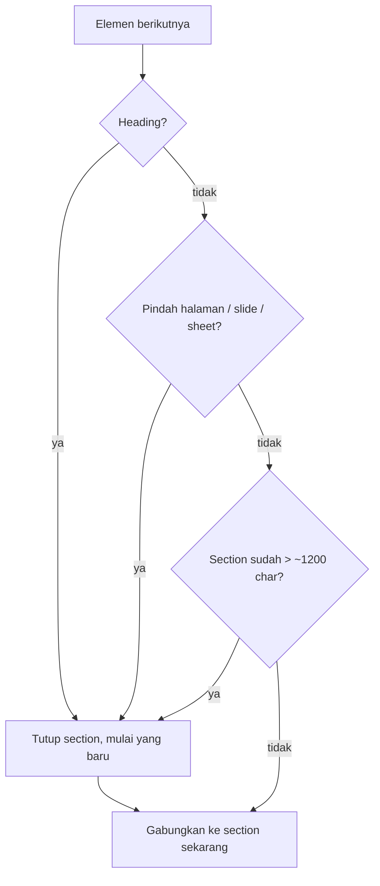
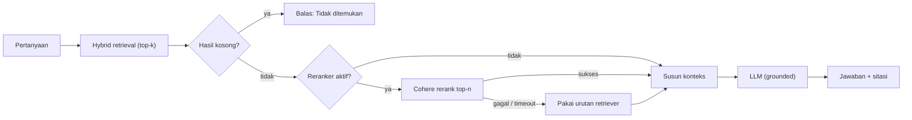

<div align="center">

# Catatan Teknis — DocIntel

### Keputusan arsitektur dan implementasi DocIntel, lengkap dengan alasan di baliknya

[Arsitektur](#1-arsitektur) · [Chunking](#3-chunking) · [Retrieval](#5-retrieval-dan-reranking) · [Model Data](#7-model-data) · [Keamanan](#10-keamanan)

</div>

---

## Daftar Isi

1. [Arsitektur](#1-arsitektur)
2. [Parsing dan ekstraksi multi-format](#2-parsing-dan-ekstraksi-multi-format)
3. [Chunking](#3-chunking)
4. [Embedding dan LLM](#4-embedding-dan-llm)
5. [Retrieval dan reranking](#5-retrieval-dan-reranking)
6. [Grounding dan sitasi](#6-grounding-dan-sitasi)
7. [Model data](#7-model-data)
8. [Evaluasi](#8-evaluasi)
9. [Observability](#9-observability)
10. [Keamanan](#10-keamanan)
11. [Deployment dan CI](#11-deployment-dan-ci)
12. [Trade-off dan pengembangan lanjutan](#12-trade-off-dan-pengembangan-lanjutan)

---

## 1. Arsitektur

Sistem ini pada dasarnya cuma dua alur yang ketemu di satu tempat: PostgreSQL + pgvector. Alur ingestion mengubah dokumen mentah jadi bentuk yang bisa dicari, deteksi format, ambil teks beserta lokasinya, potong jadi chunk, embedding, lalu simpan. Alur query menjawab pertanyaan, pertanyaan di-embed, dicarikan chunk yang relevan, disaring ulang, lalu disusun jadi jawaban yang hanya bersumber dari chunk itu. Diagram kedua alur ada di [README.md](README.md).

Di sisi kode, tiap tugas punya modulnya sendiri di `backend/app`, dan komponen embedding, LLM, serta reranker ditaruh di balik factory yang dibaca dari environment variable, jadi ganti provider tinggal ganti satu nilai env tanpa menyentuh logika RAG-nya.

| Modul (`backend/app`) | Tugas |
|---|---|
| `ingestion` | deteksi format, extractor per format, vision, normalizer |
| `chunking` | section-aware chunking |
| `embeddings` | factory embedding (pluggable) |
| `vectorstore` | PGVectorStore (hybrid search + HNSW) |
| `retrieval` | hybrid retriever + reranker Cohere |
| `llm` | factory LLM + prompt grounding |
| `rag` | orchestrator: index, query, citation builder |
| `db` / `documents` / `storage` | model data, repository, storage file |
| `observability` | tracing Langfuse |
| `core` | config, logging, error handling |

---

## 2. Parsing dan ekstraksi multi-format

Hal pertama yang harus benar: jangan percaya ekstensi file begitu saja. Deteksi format di sini menggabungkan ekstensi dengan magic bytes, jadi file yang ekstensinya menipu maupun file kosong langsung ditolak dengan pesan yang jelas. Setelah formatnya pasti, file diarahkan ke extractor yang cocok lewat sebuah registry. Apa pun formatnya, semua extractor menghasilkan bentuk yang sama, kumpulan `Element` berisi teks, tipe, dan lokasinya, jadi proses setelahnya tidak perlu tahu lagi dokumen aslinya PDF atau Excel.

| Format | Library | Lokasi sitasi |
|---|---|---|
| PDF | PyMuPDF | halaman |
| DOCX | python-docx | section/heading + indeks blok |
| PPTX | python-pptx | nomor slide (termasuk grouped shapes dan speaker notes) |
| XLSX | openpyxl/pandas | sheet + rentang baris |
| CSV/TXT | pandas/plain | rentang baris |

Gambar ditangani lewat vision LLM. Gambar yang nempel di dokumen dan halaman PDF hasil scan (yang tidak punya lapisan teks) dirender dulu lalu dikirim ke vision LLM saat ingestion, dan hasilnya disimpan sebagai `Element` bertipe `image` lengkap dengan lokasinya. Cara ini saya pilih ketimbang OCR lokal karena hasilnya lebih kaya (model bisa memahami diagram) dan sejalan dengan prinsip tidak menjalankan komputasi berat di lokal. Pengamannya: gambar yang terlalu kecil dilewati, ada batas jumlah gambar per dokumen, plus timeout dan fallback supaya satu gambar yang gagal tidak menghentikan ekstraksi.

Soal ketahanan, file yang korup tidak menggagalkan batch secara keseluruhan, dokumen itu ditandai gagal, sisanya tetap jalan. Teks dibaca sebagai UTF-8 dengan fallback, jadi byte yang aneh tidak sampai bikin crash dan teks berbahasa Indonesia tetap utuh.

---

## 3. Chunking

Cara awal yang membuat satu chunk per elemen ternyata bikin masalah: heading kepisah dari isinya, jadi pertanyaan yang butuh daftar misalnya daftar kriteria penilaian gagal menemukan konteks yang pas karena tiap poin berdiri sendiri dengan sinyal yang lemah.

Cara yang dipakai sekarang mengelompokkan elemen yang berurutan jadi satu section. Sebuah heading digabung dengan konten di bawahnya sampai ketemu heading berikutnya, batas struktur (pindah halaman, slide, atau sheet), atau batas ukuran sekitar 1200 karakter. Section yang masih kepanjangan baru dipecah lagi oleh `SentenceSplitter`, dan sitasinya ditempelkan ke elemen pertama section. Di pertanyaan uji, perubahan ini menaikkan chunk yang relevan dari luar sepuluh besar jadi sitasi paling atas dengan jawaban yang lengkap.



---

## 4. Embedding dan LLM

Embedding memakai Jina (v5, 1024 dimensi, multilingual) dan LLM memakai `llama-3.3-70b` lewat Groq. Keduanya model hosted. Pertimbangannya praktis: target deploy-nya free tier tanpa GPU, dan model hosted memberi kualitas multilingual yang bagus untuk dokumen berbahasa Indonesia tanpa perlu mengurus infrastruktur model sendiri. Gantinya, ada ketergantungan pada API key dan rate limit, yang ditekan dengan `temperature=0` (biar jawabannya konsisten) dan fallback di sisi reranker. Dimensi 1024 dipilih karena cukup menyeimbangkan kualitas dengan ukuran index HNSW. Seperti disebut di atas, semuanya bisa diganti lewat factory dan env, jadi pindah ke Gemini, OpenAI, atau model lokal cukup menambah satu cabang.

---

## 5. Retrieval dan reranking

Pencariannya hybrid. Jalur vektor (HNSW, cosine) bagus menangkap parafrase dan kemiripan makna, tapi lemah kalau yang dicari istilah atau kode yang harus persis. Jalur full-text justru kebalikannya. Menggabungkan keduanya menutup kelemahan masing-masing, dan kebetulan PGVectorStore sudah mendukung ini langsung di dalam Postgres, jadi tidak perlu memuat semua node ke memori.

Kandidat dari pencarian itu lalu disaring ulang oleh reranker Cohere model cross-encoder yang membaca pertanyaan dan tiap chunk sekaligus, jadi penilaian relevansinya lebih tajam. Reranker ini menyala secara default, tapi dibungkus fallback: kalau Cohere gagal, kena rate limit, atau timeout, query tetap jalan memakai urutan dari pencarian tadi. Saya tidak mau satu layanan luar yang sedang bermasalah bisa menjatuhkan seluruh fitur tanya-jawab. Semua parameter (top-k pencarian, top-n rerank, model) diatur lewat env.



---

## 6. Grounding dan sitasi

Prompt-nya menyuruh model menjawab hanya dari konteks yang diberikan, dan kalau jawabannya tidak ada di situ, model harus bilang "Tidak ditemukan dalam dokumen." daripada mengarang. Konteksnya juga ditandai sebagai data, bukan instruksi, untuk menekan kemungkinan prompt injection dari isi dokumen, dan model dijalankan pada `temperature=0`.

Sitasinya tidak diminta ke model. Kalau model yang menyusun rujukan, dia bisa saja salah sebut halaman. Jadi sitasi disusun langsung dari metadata tiap node hasil pencarian `document_id`, nama file, lokasi, dan cuplikan teksnya di luar LLM. Tiap sitasi membawa skor dan penanda dari mana skornya berasal (`rerank` kalau reranker aktif, `hybrid` kalau sedang fallback). Pengaturannya ada di `rag/query.py`: cari, rerank dengan fallback, susun jawaban, lalu kumpulkan sitasi jadi satu `QueryResult`.

```python
QueryResult(
    answer: str,
    citations: list[Citation],   # document_id, filename, location, snippet, score, score_type
    retrieved_chunks: int,
    model: str,
    latency_ms: int,
)
```

---

## 7. Model data

Ada dua tabel. Tabel `documents` (diurus Alembic) menyimpan status tiap file: nama, `file_hash` untuk dedup, status (`pending` → `indexing` → `indexed`/`failed`), jumlah chunk, dan path file. Node beserta vektornya disimpan di tabel `data_docintel` yang diurus PGVectorStore, lengkap dengan kolom `embedding` (`vector(1024)`, HNSW cosine), metadata, dan tsvector untuk full-text.

Ada dua catatan implementasi yang penting. Pertama, PGVectorStore memakai kunci metadata `document_id` untuk keperluannya sendiri dan menimpa nilainya dengan id node, jadi id dokumen versi aplikasi disimpan di kunci terpisah `source_id`, dan operasi hapus/ambil node memakai kunci itu. Kedua, tabel `data_docintel` baru dibuat saat ada dokumen yang benar-benar di-index; operasi yang mengaksesnya dijaga dulu dengan pengecekan keberadaan tabel supaya tetap aman di database yang masih kosong atau untuk dokumen yang gagal di-index.

---

## 8. Evaluasi

Evaluasi otomatis belum dijalankan di submission ini, tapi rancangannya sudah jelas dan sengaja dipisah dari runtime supaya tidak menambah latensi atau biaya di tiap request. Rencananya dua lapis. Lapis retrieval murni deterministik tanpa LLM: hit-rate@k dan MRR terhadap satu set kecil pertanyaan dengan sumber yang sudah ditandai, untuk mengukur apakah chunk yang benar masuk top-k. Lapis generation memakai RAGAS (faithfulness, answer relevancy, context precision/recall) dengan model penilai yang berbeda dari model penjawab, biar tidak menilai dirinya sendiri.

---

## 9. Observability

Tiap query bisa dilacak ke Langfuse, kalau key-nya tidak diisi, fungsinya jadi no-op tanpa beban sama sekali. Saya pakai auto-instrumentation dari OpenInference, jadi pemanggilan retrieval dan LLM otomatis ketangkap dan tersusun rapi di bawah satu span query, lengkap dengan input, output, dan metadata seperti latensi dan jumlah chunk. Cara auto-instrument ini saya pilih ketimbang membuat span manual satu per satu karena jejaknya lebih lengkap. Klien Langfuse dibuat secara lazy dan dibungkus penanganan error, jadi kalau setup tracing-nya bermasalah, aplikasinya tetap jalan.

---

## 10. Keamanan

Endpoint yang mengubah data (upload dan hapus) bisa dilindungi API key lewat header, defaultnya mati saat development biar nyaman, dan otomatis aktif begitu key-nya diisi di deployment. Endpoint tanya-jawab dibiarkan terbuka. Ada juga rate limit sederhana per-IP yang cukup untuk satu instance, untuk multi-instance idealnya pindah ke Redis. Upload dijaga dari beberapa sisi: batas ukuran, nama file disanitasi supaya tidak bisa dipakai path traversal, dan deteksi format menolak ekstensi yang menipu.

Penanganan error-nya terpusat. Domain error saya (`AppError` dan turunannya) otomatis dipetakan jadi JSON yang konsisten dengan status code yang pas, sementara error tak terduga disembunyikan jadi 500 generik tapi tetap dicatat lengkap di log. Tiap request juga punya request id untuk mengaitkan baris-baris log-nya. Auth dan rate limit dipasang sebagai dependency, bukan middleware, justru supaya error-nya ikut lewat exception handler terpusat tadi dan keluar sebagai 401/429 yang rapi.

| Aspek | Mekanisme |
|---|---|
| Auth (mutasi) | API key `X-API-Key`, default mati di dev, aktif saat di-set |
| Rate limit | per-IP, sliding window |
| Upload | batas ukuran, sanitasi nama file (anti path traversal), deteksi magic bytes |
| Error | `AppError` → JSON konsisten; error tak terduga → 500 generik |
| Logging | `request id` per request untuk korelasi log |

---

## 11. Deployment dan CI

Secara lokal, `docker compose up --build` menjalankan database pgvector, API (yang otomatis menjalankan migrasi Alembic saat start), dan frontend yang sudah dibangun jadi statis lalu dilayani nginx yang sekalian mem-proxy API. CI di GitHub Actions menjalankan dua job tiap push: backend (`make check` lint, type-check, dan 67 test, dengan service Postgres+pgvector untuk yang integrasi) dan frontend (build).

Versi live-nya dipecah tiga: backend di Hugging Face Spaces (Docker), database di Supabase, frontend di Vercel. Frontend memanggil backend lewat URL absolut yang diatur dari env, dan CORS di backend dibatasi ke origin Vercel. Satu catatan dari pengalaman: koneksi asyncpg ke Supabase harus lewat session pooler atau koneksi langsung, bukan transaction pooler, karena pooler mode transaksi memutus prepared statement yang dipakai asyncpg.

---

## 12. Trade-off dan pengembangan lanjutan

Dedup di level file sudah ada lewat hash, tapi `index_document` sendiri masih append-only, idealnya dia upsert berdasarkan id dokumen biar re-index aman dari jalur mana pun. Chunking yang sadar struktur sudah banyak membantu, tapi section yang sangat panjang dan terpaksa dipecah masih kehilangan konteks heading di potongan lanjutannya, bisa diperbaiki dengan menempelkan heading di tiap sub-chunk atau lewat small-to-big retrieval. Selebihnya: versioning dokumen, cache embedding per chunk, penanganan gambar di dalam sel tabel, dan memisahkan task embedding untuk query dan dokumen.

---

<div align="center">

Bagian dari proyek <a href="README.md">DocIntel</a> · Dibuat oleh Mugni Hidayah

</div>
